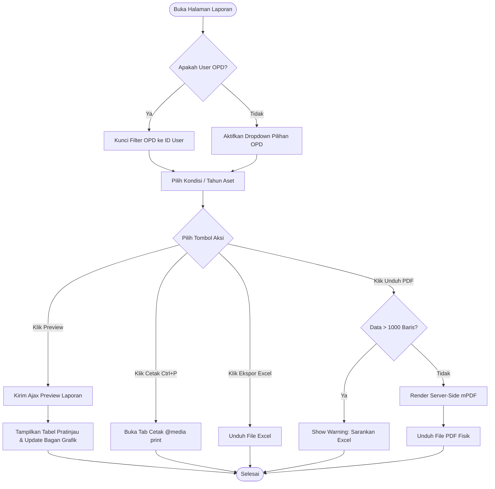
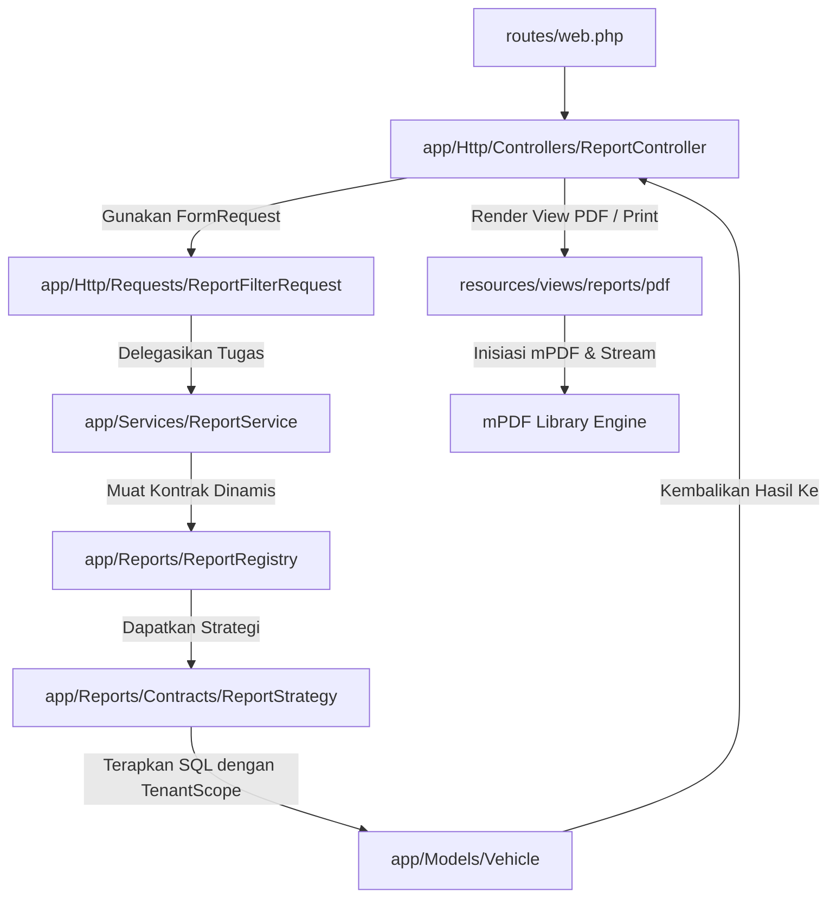

# SPESIFIKASI FITUR: MODUL LAPORAN (REPORTING)

## 1. Ringkasan
- **Nama Fitur**: Modul Laporan (Reporting Module)
- **Tujuan**: Menyediakan rekapitulasi data aset kendaraan dinas secara modular, aman (terisolasi per instansi), terperinci, serta mendukung ekspor ke format Excel, PDF cetak ramah browser, dan PDF formal dengan kop surat serta tanda tangan pejabat yang dapat dikonfigurasi.
- **User Target**: Superadmin, Admin, dan OPD (dengan pembatasan akses data).
- **Prioritas**: P1 (Penting & Strategis)

---

## 2. User Story
* **Sebagai Superadmin/Admin**, saya ingin menarik laporan kendaraan dinas dari seluruh OPD lintas sektoral, sehingga saya dapat menganalisis total aset daerah, kondisi fisik kendaraan secara makro, kelengkapan surat di tingkat kabupaten/provinsi, dan memantau status operasionalnya.
* **Sebagai Admin OPD**, saya ingin menarik laporan kendaraan dinas khusus yang dikelola oleh instansi saya sendiri, sehingga saya dapat mencetak bukti pertanggungjawaban aset daerah, memonitor masa berlaku STNK kendaraan dinas kami, dan mendeteksi unit yang butuh pemeliharaan tanpa resiko melihat atau membocorkan data OPD lain.

---

## 3. Acceptance Criteria
### A. Kriteria Keamanan & Otorisasi (*Tenant Isolation*)
- [ ] Pengguna dengan peran `opd` **HANYA** dapat menarik dan mengunduh laporan kendaraan milik OPD mereka sendiri.
- [ ] Pengguna `opd` **TIDAK BOLEH** memiliki opsi untuk memilih filter OPD lain di antarmuka (filter OPD disembunyikan atau dikunci pada OPD mereka).
- [ ] Jika pengguna `opd` secara sengaja mengubah parameter `opd_id` pada kiriman permintaan (request payload), sistem harus menolak akses secara mutlak (Fail-Safe via `TenantScope` dan validasi FormRequest).
- [ ] Pengguna `superadmin` dan `admin` dapat memilih filter untuk seluruh OPD secara global.

### B. Kriteria Antarmuka Interaktif (*Interactive Preview*)
- [ ] Halaman dashboard laporan menyediakan pemfilteran berbasis: Kondisi Kendaraan, Instansi OPD (untuk Admin Global), dan Tahun Perolehan.
- [ ] Tersedia fitur **"Pratinjau Laporan" (Ajax Preview)** yang menampilkan tabel isi laporan (sampel/preview data asli) secara instan tanpa perlu memuat ulang halaman.
- [ ] Pratinjau tabel harus menampilkan informasi paginasi yang rapi serta jumlah data total yang akurat.
- [ ] Visualisasi ringkasan didukung oleh bagan grafik lingkaran/lingkaran donat (Kondisi Aset) dan diagram batang (Sebaran Aset) secara interaktif.

### C. Kriteria Ekspor & Format Cetak (*Export Engine*)
- [ ] Ekspor ke format Excel (.xlsx) menghasilkan struktur kolom yang rapi, normalisasi tanggal Indonesia, pemisah ribuan mata uang yang benar, dan header yang jelas.
- [ ] Fitur cetak ke PDF didesain menggunakan CSS `@media print` khusus agar dokumen tercetak secara presisi, bersih dari navigasi sidebar/footer web, dan hemat tinta saat dicetak via browser bawaan pengguna.
- [ ] Ekspor PDF Server-Side berbasis **mPDF** yang memproduksi unduhan berkas PDF fisik A4 Landscape secara langsung, dengan visualisasi modern (Inter font, metrik ringkasan data, filter chips, dan layout tanda tangan) mengadopsi kemewahan SIPAT.
- [ ] Sistem proteksi RAM (Data Guard) yang secara otomatis menolak ekspor PDF untuk kueri skala besar (> 1.000 baris) demi mencegah memori *crash* di server produksi, lalu menyarankan ekspor via Excel.
- [ ] PDF formal wajib memakai konfigurasi dokumen terpusat: kop surat aktif, logo instansi, pejabat penanda tangan, ukuran kertas, orientasi, pilihan ringkasan, dan pilihan blok tanda tangan per jenis laporan.
- [ ] Jika konfigurasi dokumen belum tersedia atau database bermasalah, ekspor PDF tetap memiliki fallback aman agar tidak gagal 500.

### D. Kriteria Pengaturan Dokumen Laporan
- [ ] Halaman pengaturan laporan hanya dapat diakses oleh `superadmin`.
- [ ] Superadmin dapat memperbarui kop surat laporan: nama pemerintah, nama instansi, unit, alamat, telepon, email, website, dan logo.
- [ ] Superadmin dapat memperbarui pejabat penanda tangan: nama, jabatan, NIP, pangkat/golongan, kota tanda tangan, dan gambar tanda tangan.
- [ ] Superadmin dapat mengatur perilaku ekspor per tipe laporan: ukuran kertas (`A4`, `F4`, `Letter`, `Legal`), orientasi (`L`/`P`), tampilkan ringkasan, dan tampilkan tanda tangan.
- [ ] Unggahan logo dan tanda tangan disimpan di `public/uploads/report/` dengan penggantian berkas lama agar tidak menumpuk.

---

## 4. Kebutuhan Teknis
- **Tabel baru**: Ya, untuk konfigurasi dokumen laporan:
  - `report_letterheads` -> Menyimpan kop surat aktif/default, identitas instansi, dan path logo.
  - `report_signatories` -> Menyimpan pejabat penanda tangan aktif/default dan path gambar tanda tangan.
  - `report_export_settings` -> Menyimpan aturan ekspor per tipe laporan, termasuk ukuran kertas, orientasi, ringkasan, dan tanda tangan.
- **Kolom baru**: Tidak.
- **Foreign Key**: Ya, `report_export_settings.letterhead_id` -> `report_letterheads.id` dan `report_export_settings.signatory_id` -> `report_signatories.id`, keduanya `nullOnDelete()` agar konfigurasi tipe laporan tidak rusak saat master dokumen dihapus.
- **Endpoint baru**: Ya, terdaftar sebagai rute terproteksi:
  - `GET /reports` -> Menampilkan dashboard utama laporan.
  - `GET /reports/preview` -> AJAX penarikan sampel tabel preview data terfilter (HTML partial).
  - `GET /reports/export` -> Mengunduh berkas laporan dalam format Excel.
  - `GET /reports/print` -> Membuka tab baru pratinjau cetak ramah browser (Ctrl+P).
  - `GET /reports/pdf` -> Mengunduh berkas PDF formal hasil render server mPDF dengan proteksi memori dinamis.
  - `GET /reports/settings` -> Menampilkan pengaturan kop, tanda tangan, dan ekspor laporan khusus superadmin.
  - `POST /reports/settings/letterhead` -> Menyimpan konfigurasi kop surat.
  - `POST /reports/settings/signatory` -> Menyimpan konfigurasi pejabat penanda tangan.
  - `POST /reports/settings/export` -> Menyimpan aturan ekspor per tipe laporan.
- **Model baru**:
  - `App\Models\ReportLetterhead`
  - `App\Models\ReportSignatory`
  - `App\Models\ReportExportSetting`
- **Controller/Service baru**:
  - `App\Http\Controllers\ReportSettingController` -> UI dan aksi pengaturan dokumen laporan.
  - `App\Services\ReportDocumentSettingService` -> Pembacaan konfigurasi dokumen per tipe laporan plus fallback aman.
- **Seeder baru**:
  - `Database\Seeders\ReportSettingSeeder` -> Mengisi konfigurasi kop, tanda tangan, dan default ekspor awal.
- **View baru**:
  - `resources/views/reports/settings.blade.php` -> Halaman pengaturan laporan.
  - `resources/views/reports/pdf.blade.php` -> Template PDF server-side mPDF.
- **Storage publik**:
  - `public/uploads/report/logo/` -> Logo kop surat laporan.
  - `public/uploads/report/signature/` -> Gambar tanda tangan pejabat.

---

## 5. Diagram Alur (Flowcharts)

### A. Alur Pengguna (User Flow)


### B. Alur Data (Data Flow)


### C. Alur Sistem (System Flow)


### D. Alur Pengaturan Dokumen PDF
```mermaid
graph TD
    Start([Superadmin buka /reports/settings]) --> Load[ReportSettingController@index]
    Load --> Registry[ReportRegistry: daftar tipe laporan]
    Load --> Current[Ambil letterhead, signatory, export settings aktif]
    Current --> Form[resources/views/reports/settings]
    Form --> SaveLetterhead[Simpan Kop Surat]
    Form --> SaveSignatory[Simpan Pejabat TTD]
    Form --> SaveExport[Simpan Setting Ekspor per Tipe]
    SaveLetterhead --> UploadLogo[Upload/Hapus Logo Lama]
    SaveSignatory --> UploadSignature[Upload/Hapus TTD Lama]
    SaveExport --> Link[Hubungkan tipe laporan ke kop dan TTD aktif]
    UploadLogo --> Done([Konfigurasi Siap Dipakai PDF])
    UploadSignature --> Done
    Link --> Done
```

---

## 6. Catatan Operasional Penting
- Jalankan migration `2026_05_19_100810_create_report_settings_tables.php` sebelum memakai PDF formal dan halaman pengaturan laporan.
- Jalankan `ReportSettingSeeder` melalui `DatabaseSeeder` agar kop surat, pejabat penanda tangan, dan aturan ekspor awal tersedia.
- Folder `public/uploads/report/logo` dan `public/uploads/report/signature` harus dapat ditulis oleh aplikasi.
- Endpoint `/reports/settings*` wajib tetap khusus `superadmin` karena mengubah identitas dokumen resmi.
- Untuk dataset besar, PDF mPDF tetap dibatasi oleh Data Guard; Excel adalah jalur ekspor utama untuk data di atas 1.000 baris.
