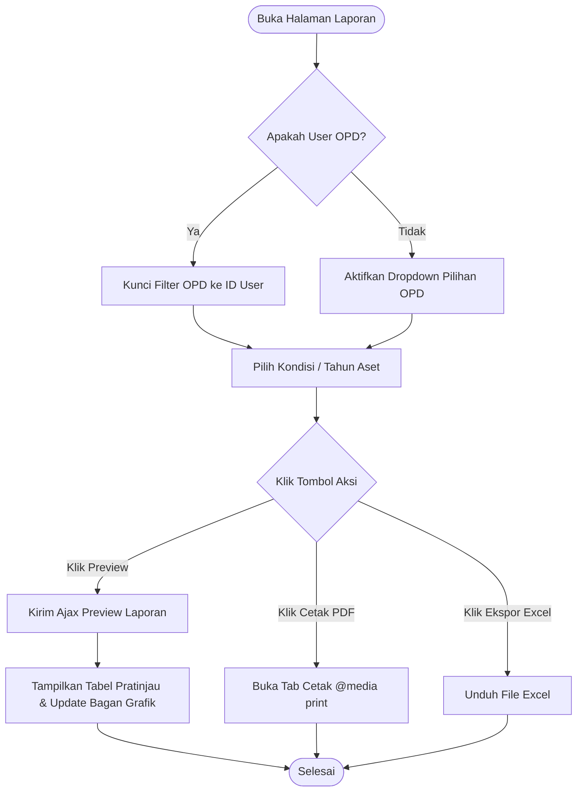
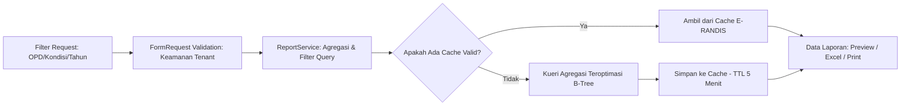
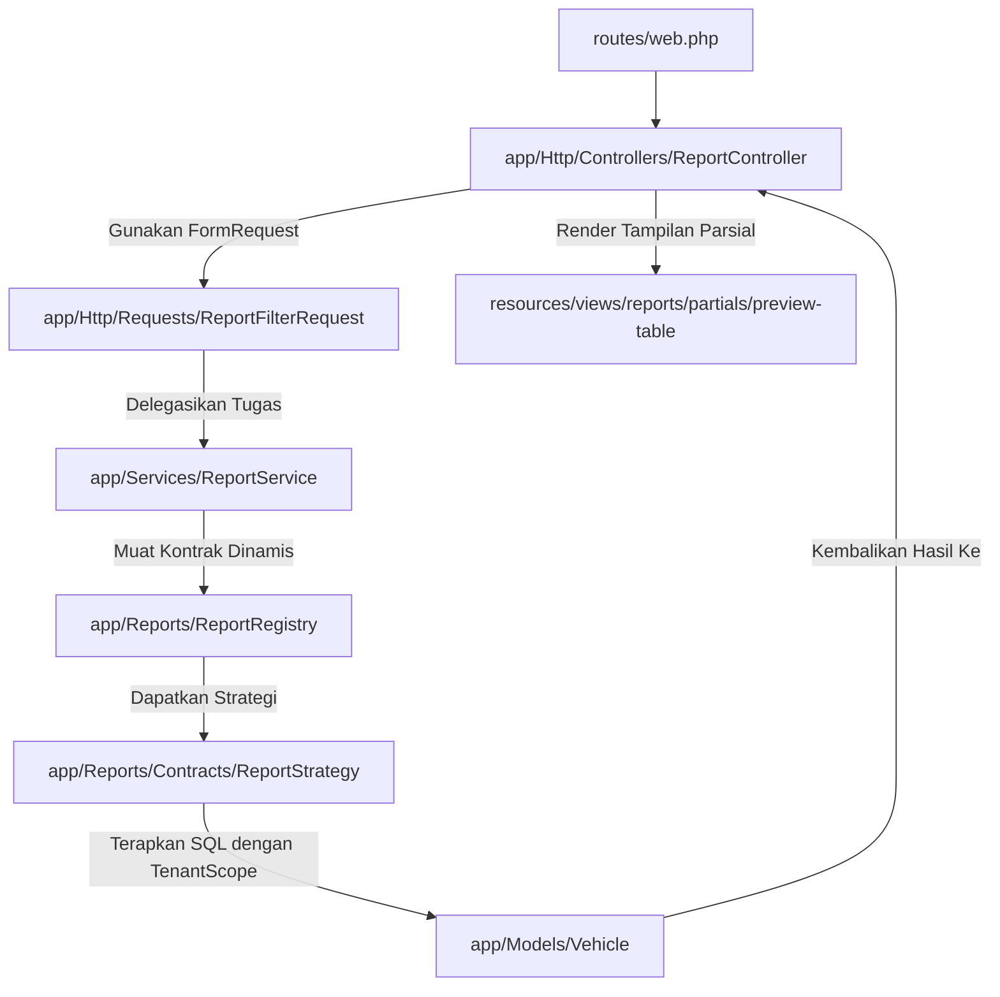

# SPESIFIKASI FITUR: MODUL LAPORAN (REPORTING)

## 1. Ringkasan
- **Nama Fitur**: Modul Laporan (Reporting Module)
- **Tujuan**: Menyediakan rekapitulasi data aset kendaraan dinas secara modular, aman (terisolasi per instansi), terperinci, serta mendukung ekspor ke format Excel dan PDF cetak ramah browser.
- **User Target**: Superadmin, Admin, dan OPD (dengan pembatasan akses data).
- **Prioritas**: P1 (Penting & Strategis)

---

## 2. User Story
* **Sebagai Superadmin/Admin**, saya ingin menarik laporan kendaraan dinas dari seluruh OPD lintas sektoral, sehingga saya dapat menganalisis total aset daerah, kondisi fisik kendaraan secara makro, kelengkapan surat di tingkat kabupaten/provinsi, dan memantau status operasionalnya.
* **Sebagai Admin OPD**, saya ingin menarik laporan kendaraan dinas khusus yang dikelola oleh instansi saya sendiri, sehingga saya dapat mencetak bukti pertanggungjawaban aset daerah, memonitor masa berlaku STNK kendaraan dinas kami, dan mendeteksi unit yang butuh pemeliharaan tanpa resiko melihat atau membocorkan data OPD lain.

---

## 3. Acceptance Criteria
### A. Kriteria Keamanan & Otorisasi (*Tenant Isolation*)
- [ ] Pengguna dengan peran `opd` **HANYA** dapat menarik dan mengunduh laporan kendaraan milik OPD mereka sendiri.
- [ ] Pengguna `opd` **TIDAK BOLEH** memiliki opsi untuk memilih filter OPD lain di antarmuka (filter OPD disembunyikan atau dikunci pada OPD mereka).
- [ ] Jika pengguna `opd` secara sengaja mengubah parameter `opd_id` pada kiriman permintaan (request payload), sistem harus menolak akses secara mutlak (Fail-Safe via `TenantScope` dan validasi FormRequest).
- [ ] Pengguna `superadmin` dan `admin` dapat memilih filter untuk seluruh OPD secara global.

### B. Kriteria Antarmuka Interaktif (*Interactive Preview*)
- [ ] Halaman dashboard laporan menyediakan pemfilteran berbasis: Kondisi Kendaraan, Instansi OPD (untuk Admin Global), dan Tahun Perolehan.
- [ ] Tersedia fitur **"Pratinjau Laporan" (Ajax Preview)** yang menampilkan tabel isi laporan (sampel/preview data asli) secara instan tanpa perlu memuat ulang halaman.
- [ ] Pratinjau tabel harus menampilkan informasi paginasi yang rapi serta jumlah data total yang akurat.
- [ ] Visualisasi ringkasan didukung oleh bagan grafik lingkaran/lingkaran donat (Kondisi Aset) dan diagram batang (Sebaran Aset) secara interaktif.

### C. Kriteria Ekspor & Format Cetak (*Export Engine*)
- [ ] Ekspor ke format Excel (.xlsx) menghasilkan struktur kolom yang rapi, normalisasi tanggal Indonesia, pemisah ribuan mata uang yang benar, dan header yang jelas.
- [ ] Fitur cetak ke PDF didesain menggunakan CSS `@media print` khusus agar dokumen tercetak secara presisi, bersih dari navigasi sidebar/footer web, dan hemat tinta saat dicetak via browser bawaan pengguna.

---

## 4. Kebutuhan Teknis
- **Tabel baru**: Tidak (Menggunakan tabel yang sudah ada: `vehicles`, `opds`, `vehicle_types`).
- **Kolom baru**: Tidak.
- **Foreign Key**: Tidak (Memanfaatkan relasi foreign key `opd_id` dan `vehicle_type_id` pada tabel `vehicles`).
- **Endpoint baru**: Ya, terdaftar sebagai rute terproteksi:
  - `GET /reports` -> Menampilkan dashboard utama laporan.
  - `GET /reports/preview` -> AJAX penarikan sampel tabel preview data terfilter (HTML partial).
  - `GET /reports/export` -> Mengunduh berkas laporan dalam format Excel.
  - `GET /reports/print` -> Membuka tab baru tampilan bersih untuk cetak PDF/Kertas.

---

## 5. Diagram Alur (Flowcharts)

### A. Alur Pengguna (User Flow)

### B. Alur Data (Data Flow)

### C. Alur Sistem (System Flow)

