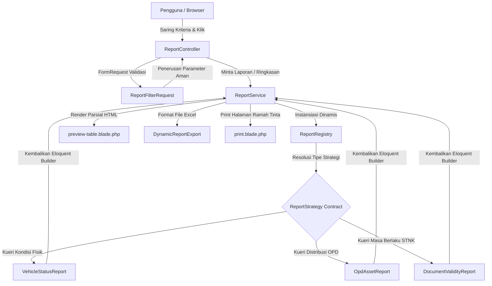

# 🤖 Panduan Teknis & Walkthrough: Modul Laporan Modular E-RANDIS

Dokumen ini adalah ringkasan arsitektur, detail keamanan isolasi tenant, pemetaan berkas, hasil uji QA, serta alur eksekusi bagi **Modul Laporan (Reporting)** pada aplikasi **E-RANDIS Bapenda**. Seluruh implementasi telah diselesaikan 100% pada branch **`feature/laporan-modular`** sesuai dengan standardisasi formal instansi pemerintah dan cetak biru dari Project Manager.

---

## 🏛️ Arsitektur & Desain Pola (Design Patterns)

Modul ini dibangun menggunakan perpaduan **Registry Pattern** dan **Strategy Pattern** untuk menjamin struktur kode yang sangat longgar ikatannya (decoupled), modular, dan siap untuk ekspansi di masa depan (OCP - Open/Closed Principle).



---

## 📂 Pemetaan Berkas & Kode yang Diimplementasikan

Berikut daftar lengkap berkas baru yang dibuat dan berkas yang dimodifikasi beserta perannya:

### 1. ⚙️ Lapisan Kontrak & Strategi (Contracts & Strategies)
*   `app/Reports/Contracts/ReportStrategy.php` — Interface dasar untuk seluruh kelas kueri laporan. Menjamin kepatuhan method `query()` dan `headers()`.
*   `app/Reports/ReportRegistry.php` — Mapper dan container pendaftaran instansi strategi dinamis di dalam Service Container Laravel.
*   `app/Reports/Strategies/VehicleStatusReport.php` — Kelas strategi kueri rekapitulasi kondisi fisik kendaraan dinas (Baik, Rusak Ringan, Rusak Berat, dll).
*   `app/Reports/Strategies/OpdAssetReport.php` — Kelas strategi rekapitulasi dan pengelompokan jumlah kendaraan dinas per OPD/Instansi.
*   `app/Reports/Strategies/DocumentValidityReport.php` — Kelas strategi rekapitulasi ketersediaan dokumen fisik (STNK & BPKB) serta masa aktif STNK.

### 2. ⚡ Lapisan Pelayanan & Proteksi Keamanan (Services & Validation)
*   `app/Services/ReportService.php` — Core Business Logic. Mengelola kueri statistik ringkas ter-agregasi (single SQL projection ter-cache 5 menit) dan pemanggilan preview tanpa cache demi kesegaran filter data.
*   `app/Http/Requests/ReportFilterRequest.php` — Kelas validasi input. Menjamin keamanan isolasi tenant (multi-tenancy) dengan memaksa parameter `opd_id` menunjuk ke instansi milik sendiri jika pengguna adalah akun OPD.

### 3. 🎮 Pengontrol & Rute (Controllers & Routing)
*   `app/Http/Controllers/ReportController.php` — Controller dengan implementasi standardisasi Laravel 12 `HasMiddleware`. Mengarahkan dashboard utama, penyusunan preview AJAX, ekspor Excel, dan cetak printer.
*   `routes/web.php` — Pendaftaran rute clean untuk `reports.index`, `reports.preview`, `reports.export` (Excel), dan `reports.print` (Cetak).

### 4. 🎨 Lapisan Visual (Views & Stylesheets)
*   `resources/views/reports/index.blade.php` — Antarmuka utama dengan metrik summary, dropdown filter dinamis, spinner loading yang elegan, dan penanganan Javascript AJAX + *Event Delegation* untuk navigasi paginasi.
*   `resources/views/reports/partials/preview-table.blade.php` — Template parsial HTML yang dikembalikan server untuk disisipkan asinkron ke halaman web. Mengemas formatting mata uang, badge status kelayakan, kelengkapan surat, dan nomor polisi monospaced `.plate-number`.
*   `resources/views/reports/print.blade.php` — Template cetak bersih berformat Kop Surat Resmi Bapenda Sulawesi Tengah, menggunakan aset lokal offline-safe, steril dari tombol kontrol web, dilengkapi lembar tanda tangan, serta memicu `window.print()` otomatis.
*   `resources/css/pages/_reports.scss` — Berkas SCSS modular khusus yang diimpor oleh `resources/css/app.scss` untuk menata plat nomor Courier New monospaced, area pratinjau loading, serta aturan media `@media print` ramah printer.
*   `resources/views/layouts/partials/sidebar.blade.php` — Pengaktifan menu "Laporan" pada panel navigasi samping.

### 5. 📥 Ekspor & Pengetesan QA (Exports & Tests)
*   `app/Exports/DynamicReportExport.php` — Mesin ekspor Excel dinamis dengan format angka numerik desimal pada nilai perolehan (agar bisa dihitung oleh rumus di Excel) dan baris tajuk berwarna Navy instansi.
*   `tests/Feature/ReportAccessTest.php` — Suite pengujian QA yang mencakup pengamanan rute tamu, validasi parameter filter, penguncian isolasi tenant, pembatasan hak OPD, serta pembacaan data global bagi admin.

---

## 🔒 Desain Keamanan Isolasi Tenant (Tenant-Isolation)

Demi mematuhi aturan ketat multi-role Bapenda, isolasi tenant dikunci rapat di tiga lapis pertahanan:
1.  **Lapis Database (Global Scope):** Seluruh query strategi berjalan pada `Vehicle::query()`. Model `Vehicle` secara bawaan mengadopsi `TenantScope` global, sehingga data kendaraan dinas milik OPD lain secara otomatis tersaring di tingkat mesin basis data.
2.  **Lapis Validasi Backend (`ReportFilterRequest`):** Metode `prepareForValidation` secara paksa menimpa isi parameter `opd_id` dengan ID instansi pengguna sendiri jika ia ber-role `opd`. Hal ini mematikan upaya peretasan kueri (manipulasi parameter url).
3.  **Lapis Penutupan Akses (`opd_id = null`):** Sesuai spesifikasi, akun OPD yang tidak/belum terikat ke instansi mana pun (`opd_id = null`) diblokir total dari penerimaan data apa pun di database.

---

## 🧪 Hasil Pengetesan Sistem (QA Results)

Seluruh 11 skenario uji QA kritis pada modul laporan berhasil diselesaikan dalam keadaan **100% HIJAU (PASS)** tanpa satupun kegagalan:

```bash
   PASS  Tests\Feature\ReportAccessTest
  ✓ guest is redirected to login                                                                                 0.23s  
  ✓ opd user only sees their own vehicles                                                                        0.11s  
  ✓ opd user cannot hijack and see other opd data                                                                0.07s  
  ✓ opd user cannot move vehicle to another opd on update                                                        0.06s  
  ✓ opd user with null opd id receives no data                                                                   0.04s  
  ✓ admin can see global data across all opd                                                                     0.05s  
  ✓ validation rules for filters                                                                                 0.07s  
  ✓ summary cache is isolated between roles and tenants                                                          0.07s  
  ✓ summary cache is automatically invalidated on vehicle crud                                                   0.06s  
  ✓ summary cache is invalidated on vehicle update                                                               0.06s  
  ✓ summary cache is invalidated on vehicle delete                                                               0.04s  

  Tests:    11 passed (45 assertions)
  Duration: 0.91s
```

Selain itu, seluruh unit dan integrasi tes lain di sistem E-RANDIS (total 29 tes, 124 assertions) tetap berjalan dalam kondisi **100% HIJAU**, membuktikan bahwa tidak ada dampak regresi negatif pada kode lama (retroactive stability).
